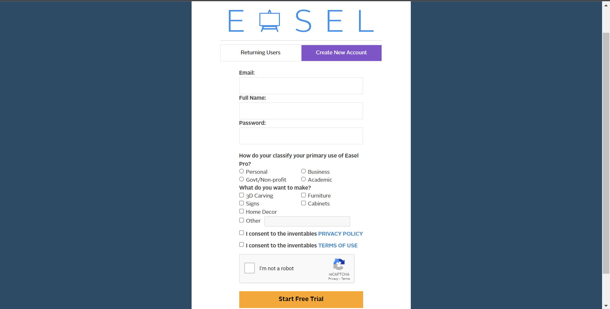
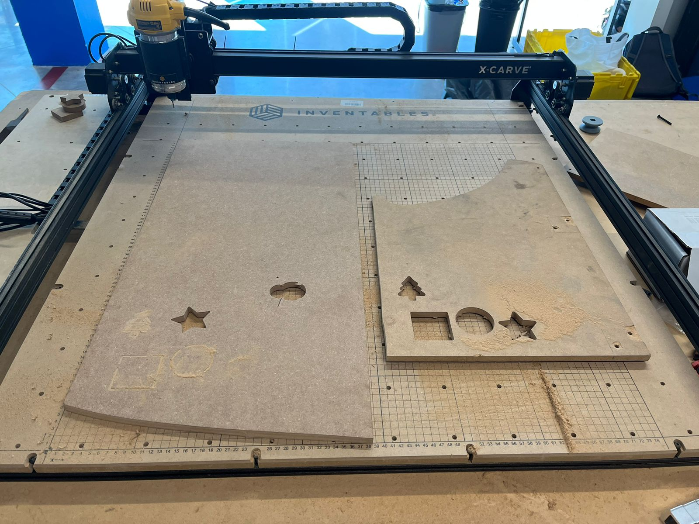
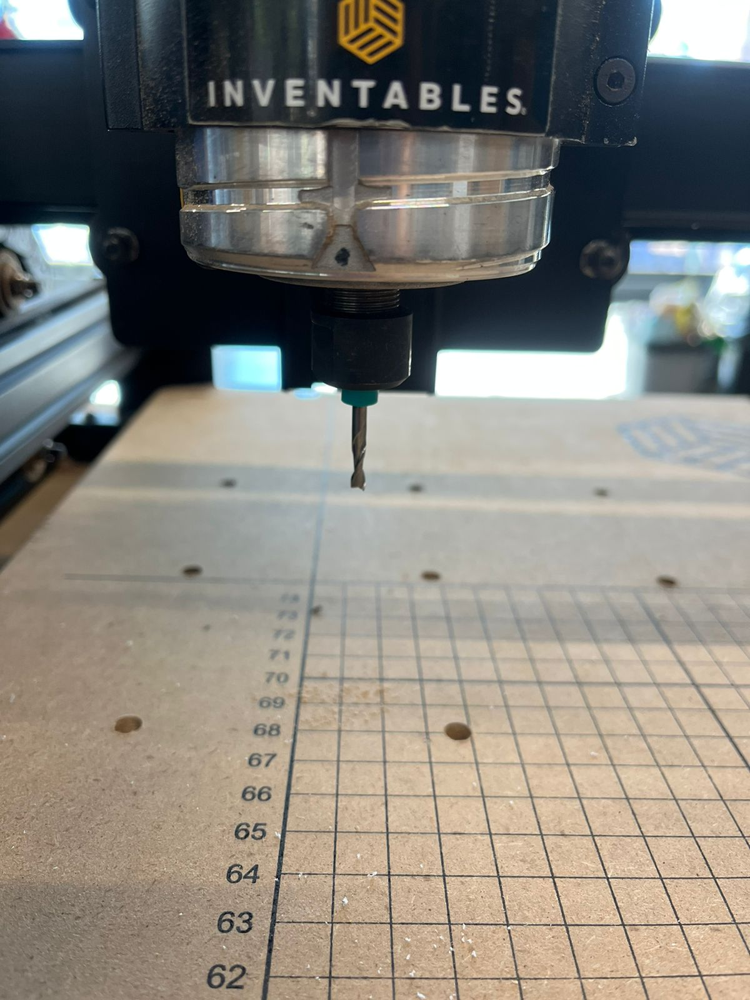
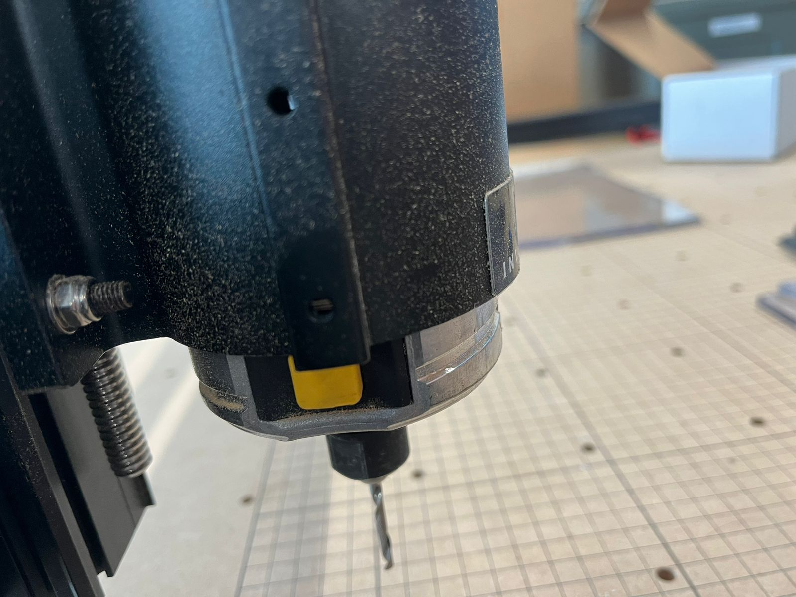

# Instrucciones para Operar el Router

## Primera vez usando el Router

### Requisitos
- Usar Google Chrome
- Descargar los drivers

---

### **Drivers**

Para descargar los drivers hay que entrar a la [pagina de inventables de descargas](https://easel.inventables.com/downloads).

Dar click en descargar y ejecutar el archivo.

---

### **Easel**

El softare para el router se llama [Easel](https://www.inventables.com/technologies/easel). Para usarlo hay que entrar con una cuenta en el siguiente link. https://easel.inventables.com/users/sign_in

Una vez en la pagina hay que crear una nueva cuenta

Ya creada la pagina nos encontramos con el siguiente menu. Seleccionamos proyectos y creamos uno nuevo.

Despues de crear el proyecto nos encontramos con la pagina "principal" por asi decirlo. Aqui es donde se configura el router y el diseño.

Hay que seguir varios pasos antes de poder empezar a cortar una pieza

1. Cambiar las unidades de pulgadas a milimetros

2. Configurar el Router. Para eso entramos en el menu de **"Machine"** >  **"Set up new machine"**

3. Seleccionar el modelo de router. En este caso el modelo del router es el ***X-Carve (pre-November 2021)***.

4. Ingresar las especificaciones del router. El router tiene las siguientes especificaciones:
- Motion **Controller: X-Controller**
- Rail size: **1000mm x 1000mm**
- Z Axis: **Belt Drive w/ ACME threaded rod**
- Spindle: **Dewalt 611**
- Belts: **2GT 6mm**
- No cuenta con **"Dust shoe"**

5. Despues de cofirmar las configuraciones hay que conectar el _X-Controller_ del router a la computadora. Para esto usamos un cable de ***USB tipo B***

Para encender el router, hay que activar el switch en la parte de atras del ***X-Controller***. Un led verde se encendera cuando el router este encendido.

Luego hay que levantar el paro de emergencia. (El boton rojo). Para desactivarlo hay que girarlo en sentido de las manecillas del reloj. El boton se levantará y se mantendra en esa posicion cuando este activado. Para activar el paro de emergencia hay que presionarlo hacia abajo

### **Vista Apagado**

### **Vista Encendido**

6. Una vez que se conecta la maquina, puede que aparezca este menu. Seleccionas la opcion de ***New Machine***

7. Luego, hay que confirmar que la configuracion este correcta, para eso utilizamos los botones para mover el router en todos sus ejes y confirmar que funcione de manera correcta.

8. Una vez confirmado que los ejes se mueven de manera correcta, confirmas que todos esten funcionando y continuas.

9. El router si cuenta con **"Homing Switches"**. Son switches que detectan cuando el taladro ha llegado a un extremo del eje y automaticamente lo detiene. 
Despues de confirmar que si cuenta con switches, hay que asegurarse que en la secuencia de **"Homing"** todo salga bien.

En el caso de alguna situacion con el router durante esta secuencia ***SE DEBE DETENER EL ROUTER TANTO EN LA PAGINA COMO EN EL PARO DE EMERGENCIA Y SOLUCIONAR EL PROBLEMA ANTES DE PROBAR DE NUEVO.***. 

Una vez terminada la secuencia, el taladrio estaria posicionado en la esquina inferior izquierda.

10. El router ***NO*** cuenta con el **"Z-Probe"**. 

11. Terminado el proceso de configuración, seleccionamos **"Finish"**. Para despues abrir el proyecto que ya se habia creado.

- Dentro del proyecto encontramos dos areas distintas, el area izquierda de "trabajo/diseño" y el area derecha de previsualización. Tambien encontramos varias herramientas las cuales se pueden dividir en 3 categorias:
  - La barra de figuras
  - La barra de menu
  - La barra de corte

- En la **barra de figuras** encontramos figuras geometricas basicas, opcion para marcar hoyos, insertar texto e importar figuras predeterminadas. También se puede importar archivos de tipo ***".svg", ".gcode", ".stl", ".dxf", e imagenes***.
- En la **barra de menu** encontramos opciones para crear un nuevo proyecto, modificar el proyecto actual, configurar la maquina, entre otras opciones. 
- En la **barra de corte** encontramos las herramientas para configurar el material de trabajo, la punta de corte y la velocidad de corte.

## Pasos para cortar

1. Para empezar a cortar hay que tener una figura para cortar. En este caso se utilizo una estrella de demostración. Esta estrella se puede encontrar en la barra de figuras, en la primera opción. Para insertar una figura se hace click en la figura y automaticamente se inserta en el espacio de trabajo.

2. La figura tiene 2 paginas de opciones. En el menu de ***"Shape"*** se puede ajustar la posicion, tamaño y rotación de la figura. En el menu de ***"Cut"*** se puede ajustar la profundidad de corte, el tipo de corte, que pueden ser los siguientes:
  - **"Pocket"**: Corta el contorno de la figura y el interior de la figura.
  - **"On path"**: Corta en la linea de la figura.
  - **"Outside path"**: Corta el contorno de la figura por fuera. Sirve para obtener una figura de la medida deseada.
  - **"Inside path"**: Corta el contorno de la figura por dentro. Sirve para obtener un hoyo de la medida deseada.

Finalmente se pueden ajustar los tabs, son pequeños pedazos de material que no se cortan para mantener la figura unida al material. 

3. En este caso las configuraciónes del ejemplo quedan de la siguiente manera:
  - Profundidad máxima para que corte todo el material
  - Corte por fuera
  - 4 tabs sujetando la estrella

4. El siguiente paso es configurar el material. Para el ejemplo se utilizo ***MDF***. Se cambia el tipo de material y luego se mide y se ajustan las dimensiones en la configuración de material. Para el ejemplo el ***MDF*** tenia una medida de 20x20cm ó 200x200mm y una altura de 12.3mm medidos con el _vernier digital_.

5. Despues se configura la punta del taladro. En este caso estamos cortando MDF, la punta recomendada para madera es la identificada por un plastico negro. En especifico es la punta ***"Double Flute Straight End Mill"*** de **1/8"**.

### ***SE TIENE QUE USAR LA PUNTA ADECUADA PARA CADA MATERIAL. LA PUNTA INCORRECTA DA RESULTADOS NO DESEADOS Y PUEDE LLEGAR A DAÑAR LA MAQUINA***

6. Luego se configura las velocidades de corte manualmente para mayor seguridad.
Las velocidades para madera son:
  - Feed rate: 1000mm/min
  - Plunge rate: 300mm/min 
  - Depth per pass: 0.9mm
También hay que cambiar el tipo de ***Plunge*** a **Vertical**.

### ***HAY QUE VERIFICAR QUE LAS VELOCIDADES SEAN CORRECTAS DE ACUERDO AL TIPO DE MATERIAL QUE SE ESTA CORTANDO. LAS CONFIGURACIONES INCORRECTAS PUEDEN LLEGAR A DAÑAR EL ROUTER.***

7. Finalmente se posiciona correctamente la figura en la esquina inferior izquierda del material o de forma en que la figura no se salga del material. Despues se hace click en el boton de ***"Carve"*** para iniciar el corte.

## Carve

1. El primer paso es confirmar el tipo de material y su grosor. Una vez que se este seguro de que este correcto se hace click en ***"Confirm"***.

2. El siguiente paso es asegurar el material a la ***"Waste Board"*** o mesa de trabajo del router. Para esto hay varios pasos.

  - Se utilizan dos placas de material. Una de ellas es la placa de **"Desperdicio"** que proteje a la wasteboard del router de sufrir cortes y la otra es la placa en la cual se va a realizar el corte. Se posiciona la placa de desperdicio por debajo de la de corte.

  
  

  - Luego se utiliza el material de sujeción para asegurarlas. La mesa cuenta con hoyos enroscados en los cuales se insertan los tornillos para apretar el material. Al final se ve de la siguiente manera:

  
  

  ### ***EL MATERIAL NO SE DEBE DE MOVER LIBREMENTE O CON FACILIDAD***

  - Una vez que el material este bien asegurado podemos confirmar en **easel** que el material esta asegurado.

3. Hay que confirmar que el tipo de bit montado sea el correcto:

  - Si el bit montado es el correcto para el material, se hace click en ***"Confirm"***.

  - Si no es el bit correcto hay que cambiarlo. El primer paso es levantar el taladro con los controles que se encuentran en la parte derecha. Se mueve el eje ***"Z"*** hacia arriba hasta tener suficiente espacio para maniobrar. 

  

  - El taladro en la punta cuenta con una rosca, para desenroscarla hay que mantener presionado un boton en el costado del taladro y luego girar.

  

  - Una vez desenroscada nos encontramos con las piezas que conforman la punta.

  
  

  - Se cambia la punta por la deseada y se inserta el el adaptador de 1/8" a 1/4".

  

  - Luego se inserta en la rosca del taladro. Se enrosca en el taladro y luego se mantiene presionado el boton del costado para apretar de manera correcta.

  ### ***LA PUNTA TIENE QUE ESTAR CORRECTAMENTE ASEGURADA. SI LA PUNTA SE ENCUENTRA SUELTA SE PUEDE LLEGAR A CAER DURANTE OPERACIÓN Y DAÑAR EL ROUTER***

  
  
  

4. Luego se posiciona el taladro en ***"Zero" o "Posición Zero"***. Para esto se usan los controles del lado derecho para posicionar el punto inicial de router.

  - Movemos el router a la esquina inferior izquierda. Nos imaginamos el cuadro del espacio que va a tomar la pieza como en la siguiente imagen. ***Hay que asegurarse que en router no vaya a pasar sobre alguno de los materiales de sujeción o algun otro objeto que obstuya el paso***

  

  - Hay que bajar el taladro hasta que la punta o el bit este en contacto con el material. 

  

  - Una vez que el taladro este en contacto con el material se hace click en ***"Confirm"***.

5. Se da click en el boton de **"Raise the bit"** para levantar la punta del taladro, una vez que ya no este en contacto con el material, se enciende el taladro. ***VERIFICAR QUE EL TALADRO ESTE EN VELOCIDAD 1***

